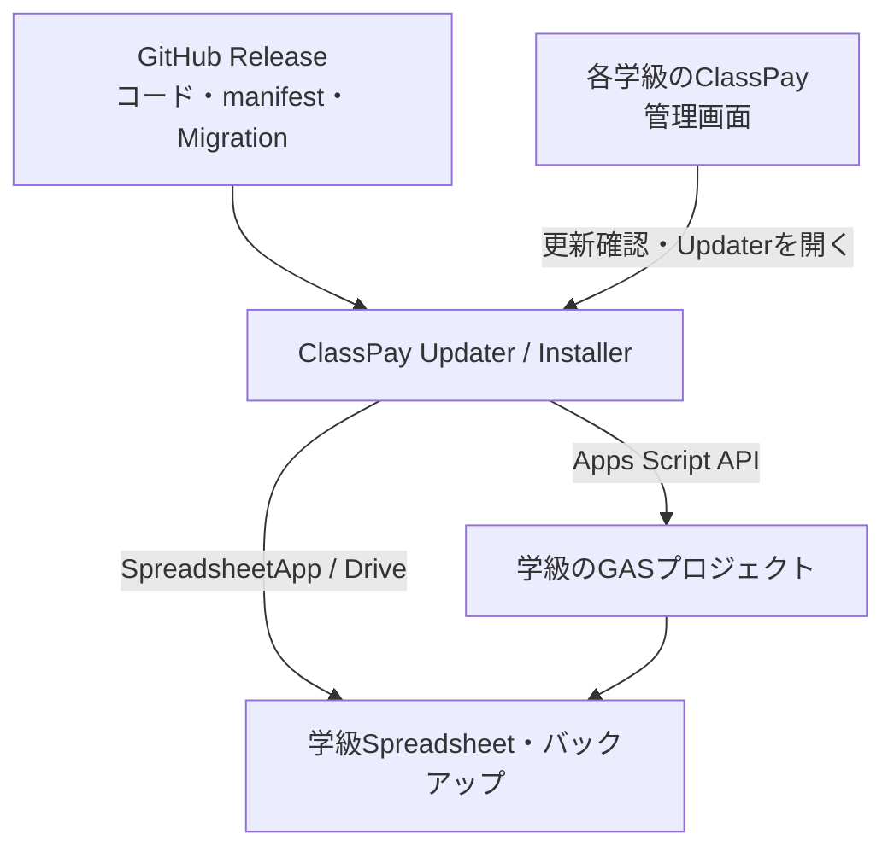

# ClassPay 配布・自動更新システム 詳細設計 v1.0

更新日: 2026-09-12  
対象: ClassPay 3.2.0 から 3.3.0 以降

## 0. 結論

ClassPay本体、外部Updater / Installer、GitHub Releaseの3層に分ける。児童データは各学級のSpreadsheetにだけ置き、中央には集約しない。ClassPay本体は更新情報の表示とUpdaterへの入口だけを担当し、自分自身を書き換えない。

最初の実装はGAS製Updater v1とする。一般配布版では、OAuth審査・署名済みmanifest・段階配信・監視を追加する。既存環境は、UpdaterにScript ID、Spreadsheet ID、Deployment ID、WebアプリURLを一度登録すればよい。

## 1. システム全体アーキテクチャ



責任境界:

|層|保持するもの|保持しないもの|
|---|---|---|
|GitHub Release|GASソース、manifest、Migration、リリースノート|児童情報、PIN、残高、token|
|Updater|利用者ごとの対象ID、更新ログ、Driveバックアップ|中央集約された児童データ|
|学級ClassPay|Users、Shops、Tx、Config、会社・政府データ|他学級のデータ|

## 2. GitHubリポジトリ構成

```text
ClassPay3/
├── Code.js, api.js, db.js ...       # ClassPay本体
├── ui_*.html                        # ClassPay画面
├── appsscript.json                  # ClassPay manifest
├── update_client.js                 # 更新確認・Updater連携
├── release/
│   ├── manifest.json                # 現在のstable release
│   ├── manifest.schema.json
│   └── migrations/
│       ├── 0.0.0-to-3.3.0.json
│       └── 3.2.0-to-3.3.0.json
├── updater/                         # 別GASプロジェクト
│   ├── Code.js
│   ├── GoogleApi.js
│   ├── ReleaseService.js
│   ├── BackupService.js
│   ├── MigrationService.js
│   ├── UpdateService.js
│   ├── InstallerService.js
│   ├── ui_index.html
│   └── appsscript.json
└── docs/
    └── DISTRIBUTION_UPDATE_SYSTEM.md
```

GitHubの`main`は開発の最新状態、`vX.Y.Z` tagは変更しない配布物とする。manifest内のファイルURLは必ずtagを参照し、`main`を実際の更新コードとして使わない。

## 3. ClassPay本体のファイル構成

既存の機能別ファイルは維持する。`update_client.js`だけを追加し、次を担当させる。

- `api_adminUpdateStatus`: manifest取得、Semantic Version比較、表示用データ返却
- `api_adminUpdaterLaunchInfo`: Script / Spreadsheet / Deployment IDをUpdaterへ渡す
- `api_adminSaveUpdaterSettings`: Updater URL等の保存
- `api_adminUpdateHistory`: UpdateHistoryの表示
- `?health=1`: バージョンと最低限の起動状態をJSONで返す

コードの自己更新処理はClassPay本体へ置かない。

## 4. Updaterのファイル構成

|ファイル|責任|
|---|---|
|Code.js|Web画面、対象設定、公開API|
|GoogleApi.js|Apps Script API呼び出し|
|ReleaseService.js|manifest、ファイル取得、SHA-256検証|
|BackupService.js|GASコード・Spreadsheetコピー|
|MigrationService.js|宣言型・再実行可能Migration|
|UpdateService.js|更新トランザクション、rollback|
|InstallerService.js|新規Spreadsheet・GAS・Deployment作成|
|ui_index.html|先生向け更新・導入画面|

## 5. Installerのファイル構成と初回処理

InstallerはUpdaterに同梱するが、サービスが大きくなった時点で分離できる。

1. 学級名と管理パスワードを受け取る。
2. Spreadsheetを作成する。
3. 必須シートとConfigを作成する。
4. `projects.create(parentId=Spreadsheet ID)`でSpreadsheetに紐づくGASを作る。
5. releaseファイルを取得しSHA-256を検証する。
6. `projects.updateContent`で全コードを配置する。
7. 初期Migrationを実行する。
8. immutable Versionを作る。
9. WebアプリDeploymentを作る。
10. BASE_URL、DEPLOYMENT_ID、VERSIONをConfigへ保存する。

途中失敗時は作成済みSpreadsheet IDを画面へ返し、復旧または削除を人が判断できるようにする。自動削除はしない。

## 6. update manifest仕様

`release/manifest.schema.json`を正とする。主要項目:

|項目|意味|
|---|---|
|schemaVersion|manifest形式の版。現在1|
|latestVersion|配布するSemantic Version|
|minimumVersion|直接更新できる最低ClassPay版|
|updateType|OPTIONAL / RECOMMENDED / REQUIRED|
|files|GASファイル名、型、tag固定URL、SHA-256|
|migrations|from / to / URL / SHA-256|
|rollback|コードとデータの復旧方針|

更新ファイル一覧は「新しく追加するファイル」ではなく、更新後GASに存在すべき全ファイルを列挙する。Apps Script APIの`updateContent`が既存ファイルを全消去して置換するためである。

正式版ではmanifestに`releaseId`、`publishedAt`、`expiresAt`、`channel`、`signature`、`keyId`を追加し、署名検証サービスを利用する。

## 7. Migration仕様

Migrationは任意コードではなくJSONの宣言型とし、Updaterだけが解釈する。v1で許可するaction:

- `ensureSheet`: なければシートを作る
- `ensureColumns`: ない列だけ末尾へ追加する
- `setConfigDefault`: キーがない時だけ設定する
- `setConfig`: 明示的に上書きする

全actionは再実行しても結果が壊れないようにする。行削除、列削除、残高再計算、Tx消去はv1では禁止する。`current → next → ... → latest`の一本道を作れない場合は更新を開始しない。

データ変換が必要な将来版では、次の二段階を使う。

1. 新列を追加し旧列も残す。
2. 新旧両方を読める互換期間を1 MINOR以上設ける。
3. 十分な期間後のMAJOR版で旧列の廃止を検討する。

## 8. rollback仕様

更新前に旧コード、旧Version、旧Deployment設定、Spreadsheetコピーを保存する。

- 自動rollback: 更新中に失敗した時、旧コードをHEADへ戻し、旧Deployment Versionへ戻す。
- 手動rollback: バックアップを選び、コードを戻して新しいGAS Versionを作り、同じDeployment IDへ割り当てる。
- データrollback: 自動では行わない。バックアップ後の正しい取引まで消えるため、Spreadsheetコピーから必要範囲だけ管理者が復旧する。

原則としてMigrationは追加型にし、古いコードも追加列を無視して動く状態を保つ。

## 9. バックアップ仕様

Google Driveに`ClassPay Backups/ClassPay-{version}-{日時}`を作る。

|ファイル|内容|
|---|---|
|source.json|`projects.getContent`の完全レスポンス|
|metadata.json|Script ID、Spreadsheet ID、Deployment、版、作成日時|
|Spreadsheetコピー|児童・残高・Tx・会社情報を含む時点コピー|

保持期間は正式版で設定可能にする。推奨は学期中すべて、または最低90日。自動削除を導入する場合も直近3世代は必ず保持する。

## 10. Apps Script APIによる自動Deployment

更新時のAPI順序:

1. `GET /projects/{scriptId}/content`
2. `GET /projects/{scriptId}/deployments/{deploymentId}`
3. Driveバックアップ
4. `PUT /projects/{scriptId}/content`
5. Migration
6. `POST /projects/{scriptId}/versions`
7. `PUT /projects/{scriptId}/deployments/{deploymentId}`

最後のPUTで`deploymentConfig.versionNumber`だけを新Versionへ進める。Deployment IDは変わらないため、WebアプリURLも維持される。新規導入だけ`deployments.create`を使う。

## 11. OAuth認証設計

Updater Webアプリは「アクセスしているユーザーとして実行」する。先生自身が対象GASとSpreadsheetを編集できることをGoogle側の権限判定に利用する。

必要scope:

|scope|用途|
|---|---|
|script.projects|コード取得・全置換・Version作成|
|script.deployments|Deployment取得・更新|
|drive|既存Spreadsheetのコピーとバックアップ|
|spreadsheets|対象SpreadsheetのMigration|
|script.external_request|GitHubとGoogle REST APIへの接続|
|userinfo.email|実行者の監査表示|

tokenやOAuth secretをClassPay、Config、GitHubへ保存しない。GAS実行中に`ScriptApp.getOAuthToken()`で短期tokenを得る。対象IDはUser Propertiesへ利用者単位で保存する。

本番公開では標準Google Cloud projectを紐づけ、OAuth同意画面、プライバシーポリシー、scope説明、検証状況を管理する。

## 12. Google Workspace学校アカウントの注意点

- 各先生はApps Script dashboardでApps Script APIによるプロジェクト管理を明示的に許可する必要がある。
- 学校管理者が外部・内部OAuthアプリを制限している場合、UpdaterのOAuth clientを信頼済みにする必要がある。
- 18歳未満の児童アカウントでUpdaterを使わせない。Updaterは先生専用とする。
- Drive外部共有、Apps Script、Webアプリ実行、API利用が組織部門単位で禁止されていないか確認する。
- 学校ごとに「Webアプリをドメイン限定にするか」「児童がどのアカウントで使うか」を決める。
- Updater所有者のドメインと利用校が異なる場合、OAuth検証と管理者承認を先に済ませる。

## 13. エラー時の復旧設計

|段階|失敗時|
|---|---|
|manifest取得・検証|変更せず終了|
|バックアップ|変更せず終了|
|コード更新|旧source.jsonを再投入|
|Migration|旧コードへ戻す。追加列は残す|
|Version作成|旧コードへ戻す|
|Deployment更新|旧Deployment Versionへ戻す|
|画面ヘルス確認|警告を記録し、先生が継続かrollbackを選ぶ|

エラーには機密情報や全行データを含めない。復旧できなかった場合は、バックアップFolder ID、SpreadsheetコピーID、失敗段階だけを表示する。

## 14. アップデート管理画面UI

ClassPay管理画面に次を追加した。

- 現在版 / 最新版
- OPTIONAL / RECOMMENDED / REQUIRED
- 公開日、更新内容、互換性
- Updater URL、Deployment ID、manifest URL設定
- Updaterを開くボタン
- UpdateHistory表示

実際の更新確認・実行・rollbackは別Updater画面で行う。更新ボタンは「バックアップを確認した」チェックがないと動かない。

## 15. 初回Installer UI

入力は学級名、管理パスワード、確認、release manifestだけとする。成功後はSpreadsheet URLとClassPay WebアプリURLを表示する。将来版では、学校名や児童情報を中央へ送らず、ブラウザ内の進捗表示だけを行う。

## 16. Version管理仕様

- ClassPay: Semantic Versioning `MAJOR.MINOR.PATCH`
- Updater: ClassPayと独立したVersion
- GAS Version: Googleが採番する整数。Semantic Versionとは別
- Config `CLASS_PAY_VERSION`: 現在のデータ構造・コード互換版
- Git tag `vX.Y.Z`: 配布コードの固定点

`PATCH`は互換性のある修正、`MINOR`は追加型の新機能、`MAJOR`は互換性を壊す変更とする。REQUIREDは重大なセキュリティ・データ破損対策に限定する。

## 17. ログ仕様

各学級の`UpdateHistory`に次を保存する。

`updateId, startedAt, finishedAt, fromVersion, toVersion, status, backupFolderId, gasVersion, deploymentId, message`

statusは`SUCCESS / FAILED / ROLLBACK`。ログに児童名、PIN、残高、取引明細、OAuth tokenを入れない。Cloud Loggingには技術エラーを残すが、保持期間と閲覧権限を学校ポリシーに合わせる。

## 18. セキュリティ仕様

- 更新権限はGoogleの編集権限で判定する。
- releaseはtag固定URLとSHA-256を使う。
- `updateContent`前に、manifestの全ファイル・重複・appsscript存在を検証する。
- Migration actionは許可リスト方式にする。
- 更新処理はUser Lockで二重実行を防ぐ。
- ClassPay本体からtoken、PIN、管理パスワードをUpdaterへ送らない。
- GitHub Actionsやsecretを使う場合は環境secretに置き、repoへ保存しない。
- 正式版は署名済みmanifest、鍵ローテーション、release承認者2名制を推奨する。
- 中央テレメトリは初期状態OFF。導入数だけ収集する場合も学級IDや児童情報を送らない。

## 19. 実装順序

1. 3.2環境の複製でUpdater v1を動かす。
2. Apps Script APIの許可とOAuth scopeを確認する。
3. `3.2.0 → 3.3.0`を実更新する。
4. WebアプリURLが変わらないことを確認する。
5. Users / Shops / Tx / Holdings / Configの件数と主要残高を更新前後で照合する。
6. コードrollbackを試す。
7. 新規Installerを試す。
8. 別の先生アカウント、別組織部門で認証を試す。
9. manifest署名とCI release生成を追加する。
10. 小規模校内beta後に一般配布する。

## 20. 段階的ロードマップ

|段階|完成条件|
|---|---|
|v1 Updater（今回）|手動登録、更新確認、コード+Spreadsheetバックアップ、SHA-256、Migration、Version、既存Deployment更新、rollback|
|v1.1 テスト版|dry-run、処理段階表示、残高・行数の自動照合、失敗注入テスト|
|v1.5 校内beta|OAuth同意画面、管理者allowlist手順、stable/beta channel、複数教員テスト|
|v2 配布版|署名manifest、CIでrelease生成、段階配信、監査ログ、バックアップ保持設定|
|v2.5 正式版|OAuth検証、障害通知、互換性マトリクス、導入診断、サポート用匿名診断書|

## 21. 既存3.2環境からの移行手順

1. 現在のSpreadsheetを手動でも1部コピーする。
2. Updaterを別GASとしてデプロイする。
3. Apps Script dashboardでAPI accessをONにする。
4. ClassPay 3.3コードを開発者が最初の1回だけ既存環境へ配置・Version更新する。
5. 管理画面「システム更新」でUpdater URLと現在のDeployment IDを保存する。
6. 以降は管理画面からUpdaterを開いて更新する。

最初の3.2→3.3自体をUpdaterで行う場合は、Updater画面へScript ID、Spreadsheet ID、Deployment IDを直接入力すればよい。3.2側に更新画面がなくても実行できる。

## 22. リリース前チェックリスト

- manifestの全SHA-256がtag上の実ファイルと一致する
- appsscriptを含む全GASファイルがfilesに列挙されている
- Migrationを2回実行しても列や設定が重複しない
- Users / Shops / Tx / Holdingsの値が変化していない
- BASE_URLとDeployment IDが変化していない
- rollback後に主要5画面が開く
- 管理者以外のアカウントがUpdaterで対象を編集できない
- ログにPIN・token・児童名が出ていない
- 学校Workspace管理者のOAuth承認を得ている

## 23. 公式仕様への参照

- Apps Script API access: https://developers.google.com/apps-script/api/how-tos/enable
- projects.updateContent: https://developers.google.com/apps-script/api/reference/rest/v1/projects/updateContent
- versions.create: https://developers.google.com/apps-script/api/reference/rest/v1/projects.versions/create
- deployments.update: https://developers.google.com/apps-script/api/reference/rest/v1/projects.deployments/update
- deployments.create: https://developers.google.com/apps-script/api/reference/rest/v1/projects.deployments/create
- Apps Script quotas: https://developers.google.com/apps-script/guides/services/quotas
